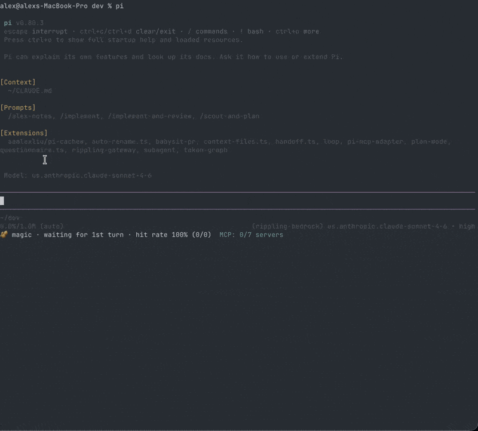

# 🥜 Cachew (cache warmer) — stop paying the cold-cache tax in pi

**You've got a long pi session open — say 600k tokens of context** — and you
walked away from it. Lunch, a meeting, a different task. By the time you come
back the prompt cache's 5-minute TTL has lapsed, so your next message re-writes
that entire 600k prefix from scratch — **~$4 *before the model generates a single
token*.** You didn't do any work; you just paid to reload the session you
already had. Cache **reads** are ~10× cheaper than input and ~12× cheaper than
cache **writes**.

Cachew keeps the cache warm with a tiny periodic ping, so picking that session
back up is a cheap cache *read* instead of an expensive cache *write* — you
don't pay $4 just to get talking again. Works for any provider/model pi can
stream (built-in or a custom gateway).



## What it costs, explicitly (Claude Opus 4.8)

Per-million-token rates:

| | input | cache write | cache read | output |
|---|--:|--:|--:|--:|
| **Opus 4.8** | $5.00 | $6.25 | **$0.50** | $25.00 |

A cache **read is 10× cheaper than input** and **12.5× cheaper than a cache write**.

Say you left a session open carrying a **600k-token** context (system prompt +
loaded files + history). Every turn re-sends that whole prefix; what you pay for
it when you come back depends entirely on whether the cache is still warm:

| your next turn | prefix billed as | cost of the 600k prefix |
|---|---|--:|
| **warm** (cache HIT) | 600k × $0.50/M | **$0.30** |
| **cold** (cache MISS — TTL lapsed) | 600k × $6.25/M | **$3.75** |

So forgetting about that session over lunch turns a $0.30 turn into a **$3.75
turn — a 12.5× tax**, paid before the model does any work. Do that a few times
across a day — every time you step away and come back — and it's real money
spent re-loading context you never lost.

Cachew's keep-alive ping is itself just a cache read — 600k × $0.50/M = **$0.30**
every ~4 min (~$4.50/hr) — and each read resets the 5-min TTL, so coming back to
the session stays in the $0.30 column. While you're actively working your own
turns keep it warm for free; the ping only earns its keep across your idle gaps.

> **Honest caveat:** the *first* warm-up after a genuinely cold prefix still pays
> one cache write to establish the entry. Cachew keeps an *already-warm* prefix
> warm — it can't make the first write free.

## Install

Cachew is a [pi package](https://pi.dev/packages). Install it per-user from git:

```bash
pi install git:github.com/aaalexliu/pi-cachew
```

Then in any pi session:

```
/cachew            # status
/cachew on|off     # enable / disable
/cachew mode magic|session
/cachew every <seconds>
/cachew reset      # reset hit/miss stats
/cachew footer on|off  # show/hide the footer while keeping cachew active
/cachew now        # warm immediately (manual/debug — normally automatic)
```

The footer shows mode, seconds-until-next-ping, and hit rate unless disabled with `/cachew footer off`. To pin a version,
install a tag or commit, e.g. `pi install git:github.com/aaalexliu/pi-cachew@v0.1.0`.
Update later with `pi update --extensions`; remove with
`pi remove git:github.com/aaalexliu/pi-cachew`.

> **Security note:** pi extensions run with full system access. Review the
> source (`index.ts`) before installing.

---

## Why this exists — when does the cache expire?

Prompt caches don't live forever. Typical retention windows:

| Provider / model | Caching | Expiry |
|---|---|---|
| Anthropic Claude (direct or via Bedrock), default "short" retention | Anthropic prompt cache | **5-min sliding TTL** — evicted 5 min after the *last* read; every read resets the clock. e.g. Opus cacheWrite $6.25/Mtok · cacheRead $0.50/Mtok |
| Claude Sonnet | same | 5-min sliding ($3.75 / $0.30) |
| Claude Haiku | same | 5-min sliding ($1.25 / $0.10) |
| Models with no caching | none (provider rejects cache points) | n/a |
| OpenAI `gpt-*` | OpenAI auto-cache, no `cache_control` | ~5–10 min idle, not directly controllable |

When only "short" retention is enabled (the common case), every cacheable Claude
is on the **5-minute sliding window**. By default Cachew only warms models that
actually advertise caching (`cost.cacheRead > 0`); set `warmAnyModel: true` in
`~/.pi/agent/cachew.json` to warm everything.

---

## Two ways to keep warm

Configure the default with `~/.pi/agent/cachew.json`; switch at runtime with
`/cachew mode magic|session`.

### `magic` (behind the scenes, default)

**Exactly what it does:**

Prompt caches are *prefix-addressed*: a request is a cache hit only if its
leading tokens (tools → system → message history) are byte-identical to a
previous request, up to the provider's cache breakpoint. Reading that cached
prefix resets its TTL, and you pay only the cheap `cacheRead` rate for it.

Cachew warms the cache two ways, preferring the first:

**1. Replay (preferred).** Cachew captures the **exact serialized request** pi
last sent to the provider via the `before_provider_request` event. That payload
*is* the literal wire body — a Bedrock `ConverseStreamCommandInput`, an Anthropic
`MessageCreateParams`, etc. — with system / messages / tools / cache-points
already baked in. At ping time it replays that blob **verbatim** through the
provider's `onPayload` hook, so the bytes are identical by construction. No
reconstruction, so no drift. Because pi only ever calls the model to *generate a
reply*, the captured request already ends in a user/tool turn, so it's valid
as-is — **no throwaway turn is appended.**

**2. Reconstruct (fallback).** If no usable payload has been captured yet (no
real request since launch, or an unrecognised wire shape), Cachew reconstructs
the **exact** prefix pi would send:

- the message history, run through pi's own `convertToLlm()` (identical
  serialization → identical bytes);
- the live system prompt (`ctx.getSystemPrompt()`);
- the active tool set (`getActiveTools()` ∩ `getAllTools()`, in order);

and appends **one throwaway `"."` user turn** (an idle conversation ends on an
assistant message, which isn't a valid trailing turn).

Then, `warmEveryMs` after the last activity (only while idle), it:

1. looks up the provider for the model's api via `getApiProvider(model.api)` —
   this resolves built-in **and** custom providers (e.g. a custom Bedrock gateway),
   because pi registers them into the same shared api registry that extensions
   resolve;
2. resolves auth/headers/env for the model via the model registry;
3. calls the provider's `streamSimple()` with `maxTokens: 1` and
   `cacheRetention: "short"` plus an abort signal — passing `onPayload` to
   replay the captured request in replay mode.

The provider re-reads the long cached prefix (cheap) and emits ~1 token. The TTL
is refreshed. **None of this is written to your session history.**

Net cost ≈ `cacheRead(prefix)` + a couple input tokens + 1 output token.

### Why replay only touches *one* field (and treats the rest as a black box)

The whole point of replay is that the prefix is **opaque**: Cachew never parses
the captured payload's system / messages / tools / cache breakpoints — it hands
the blob straight back to the provider. The single exception is the
**output-token cap**: a raw replay would inherit the original request's large
`maxTokens` (e.g. 64k) and the model would generate a *full* reply at the output
rate, defeating the point of a cheap ping. So Cachew caps output to 1 token —
and *that one field* is the only thing whose name/location differs by provider
wire format:

| Wire shape | Field set to `1` |
|---|---|
| Bedrock Converse | `inferenceConfig.maxTokens` |
| Anthropic Messages | `max_tokens` |
| OpenAI Responses | `max_output_tokens` |
| OpenAI Chat Completions | `max_completion_tokens` |
| Google Gemini / Vertex | `generationConfig.maxOutputTokens` |

This lives in `capOutputTokens()`. It clones-with-override (never mutates the
captured object) and returns `undefined` for an unrecognised shape — exactly the
signal to fall back to reconstruction. Capping output does **not** change the
cache key: `maxTokens` is a generation parameter, not part of the cached prefix
content, so the read still hits.

> Why not skip the cap and treat it as a *true* black box? Because then the ping
> would cost a full generated response instead of ~1 output token. The cap is
> the price of "cheap"; everything else stays opaque.

> ⚠️ **Do not pass `reasoning: "off"`.** The Bedrock streamer rejects it with a
> `SerializationException: STRING_VALUE cannot be converted to Integer`.
> Omitting reasoning already disables extended thinking, and `maxTokens: 1`
> keeps the ping minimal. (Verified live — see below.)

**Safety:** if a ping comes back as a cache *write* (`cacheRead == 0` or
`cacheWrite > cacheRead`), the prefix drifted and we paid near-full price. After
`MAX_CONSEC_MISSES` such pings in a row, Cachew disables itself and warns you.

### `session` (visible)

Sends a literal `"."` as a real user message into the conversation on the timer
(`pi.sendUserMessage(".")`). pi builds the request, so it's a guaranteed-faithful
cache read — but it adds a `.` user turn + a short assistant reply to your
history and costs that reply's output tokens. Dead simple; no snapshotting. Stats
are read from the reply's usage via `message_end`.

---

## Why magic mode is correct (and cheap)

Two facts make magic mode work. Both are easy to get subtly wrong, so they're
spelled out here.

### A) Why the ping is never written to your history

pi has two separate layers:

- **Agent / session layer** — owns your conversation. It builds a request from
  your real history, and *after* a reply returns it appends the turn to the
  session and persists it to the `.jsonl` file. This is what emits
  `message_end` / `turn_end` and renders bubbles in the TUI.
- **Provider / API layer** — `provider.streamSimple(model, context, options)`.
  A *stateless* function: you hand it an explicit `{ systemPrompt, tools,
  messages }`, it streams from the gateway and returns a result. It has **no
  concept of your session** and never reads or writes the `.jsonl`.

Magic mode calls `streamSimple()` **directly**, skipping the agent layer
entirely, with a context it assembled itself. It reads `msg.usage` and throws
the message away. It never calls `sessionManager.append`, `pi.sendMessage`,
`pi.sendUserMessage`, or `pi.appendEntry` — so there is no code path from the
ping to your history. (That's exactly what `session` mode does differently: it
goes *through* the agent layer via `pi.sendUserMessage(".")`, so its `.` and the
reply *do* get persisted.)

### B) Why the throwaway `.` doesn't make your next real prompt a cache miss

A request is a token stream:

```
[ tools ][ system ][ msg_1 ] … [ msg_n ][ trailing turn ]
```

Prompt caching is **prefix-addressed with a breakpoint**: the provider caches
everything up to a `cache_control` marker, and that marker sits at the **end of
the stable prefix — before the trailing turn**. So the cached entry is:

```
CACHED PREFIX = [ tools ][ system ][ your real history ]
                                                        ^ breakpoint
```

The magic ping sends:

```
[ tools ][ system ][ your real history ] · [ "." ]
└───────── reads the cached prefix ──┘   └ tiny new input, AFTER the breakpoint
```

The `.` is *past* the breakpoint, so it isn't part of the cached/compared prefix
— just a couple of cheap incremental input tokens — and reading the prefix
**refreshes its 5-min TTL**. Your next real prompt sends:

```
[ tools ][ system ][ your real history ] · [ your real message ]
└─────── reads the SAME cached prefix ┘   └ your new content, AFTER the breakpoint
```

Both requests are **byte-identical up to the breakpoint** and diverge only after
it (the uncached region anyway). Crucially the `.` was **never persisted**, so
it isn't in your real request and doesn't shift the prefix → cache **read** →
hit. Two properties combine: the `.` is *after* the breakpoint (doesn't alter
the cached prefix) **and** it's never written to history (doesn't appear in your
next request).

### C) Why snapshot the live prefix instead of reading the `.jsonl` or just the last turn

The cache key is the **exact bytes pi sends over the wire**, and the `.jsonl` is
not those bytes:

- **`.jsonl` is pi's storage schema, not the request.** What goes to the
  provider is `convertToLlm(messages)` + the assembled system prompt + the
  ordered tool schemas. The `.jsonl` stores session *entries* (tool results,
  custom entries, timestamps, labels, branch/tree info, reasoning blocks,
  display hints) in a different shape. Rebuilding the wire prefix from it means
  re-implementing pi's whole serialization pipeline and keeping it byte-perfect
  across every pi version — any drift is a `cacheWrite`. Calling pi's own
  `convertToLlm(event.messages)` gives those exact bytes for free.
- **The system prompt isn't a stored turn.** It's assembled at request-build
  time from the base prompt + AGENTS.md/CLAUDE.md context files + current date +
  model/tool info + *extension mutations* (e.g. context-files splicing in
  shadowed files). `ctx.getSystemPrompt()` returns the live, fully-assembled
  bytes; the `.jsonl` does not contain them.
- **Tools aren't in the `.jsonl` either.** The active set + order + schemas are
  runtime state mutated by extensions and `/tools`. They're the *first* block in
  the prefix, so a mismatch misses everything after it. `getActiveTools()`
  ∩ `getAllTools()` is the live set, in order.
- **The `context` event is the one moment in-memory == wire.** pi fires it as it
  builds the request, with `event.messages` being exactly the array about to be
  sent (already accounting for compaction, branching, queued messages).

And **"just snapshot the last turn" can't work**: a cache entry is a *prefix*,
not a suffix. To read (and refresh) `[tools][system][entire history]` the ping
must **reproduce that whole prefix** so the provider can match it. Sending only
the last turn produces `[tools][system][last turn]`, which matches nothing →
instant miss + a `cacheWrite` for a new short prefix. You can't read a suffix;
you read a prefix, so you must present the full one.

This is why the **prefix-drift safety** exists: if a ping returns `cacheRead == 0`
(a write), the live prefix diverged from what was cached, and after
`MAX_CONSEC_MISSES` in a row Cachew disables itself rather than keep paying.

---

## Commands

```
/cachew                 # status
/cachew on | off        # enable / disable
/cachew reset           # clear stats
/cachew footer on | off # show / hide the footer while keeping cachew active
/cachew debug [on|off]  # print full cache metrics + response for EVERY ping
/cachew log             # open an interactive overlay of recent pings (scrollable)
/cachew mode magic      # behind-the-scenes ping (default)
/cachew mode session    # send a literal "." into history
/cachew every <seconds> # set and persist the warm interval
/cachew now             # warm immediately (manual/debug — the loop is automatic)
```

The footer shows: mode · seconds-until-next-ping · hit rate, unless disabled with `/cachew footer off`, e.g.

```
🥜 magic · next 142s · hit rate 100% (3/3)
```

(cold-skips aren't in the footer — `/cachew` status prints them.)

## Debug mode (`/cachew debug`)

Magic-mode pings happen entirely out of band — nothing lands in your history — so
by default you never see them. `/cachew debug on` prints a one-line readout for
**every** ping (hit *and* miss), which is the fastest way to confirm magic mode
is actually landing cache reads:

```
🥜 [debug] ping #7 HIT ✅ (replay) on us.anthropic.claude-opus-4-8: cacheRead 33.0k · cacheWrite 9 · input 2 · out 1 · $0.0167 · thinking OFF · resp "."
🥜 [debug] ping #8 MISS ⚠️ (reconstruct) on us.anthropic.claude-opus-4-8: cacheRead 0 · cacheWrite 33.1k · input 2 · out 1 · $0.2074 · reconstructed prefix (no thinking)
🥜 [debug] SKIP (magic) on us.anthropic.claude-opus-4-8: cache cold — idle 372s ≥ TTL. Not re-warming for nobody; next real turn re-warms lazily.
```

Each line shows: ping #, HIT/MISS, replay-vs-reconstruct path (magic) or `session`,
the cache metrics (`cacheRead`/`cacheWrite`/`input`/`out`), the ping cost,
thinking state (magic), and the (tiny, `maxTokens:1`) response text. Cold-skips
are logged too. When debug is off, hits stay silent and only misses warn (the
original behaviour). The footer shows a 🐛 while debug is on.

## Sleep-awareness (laptops)

Relative timers freeze while your machine sleeps, so a nap longer than the 5-min
TTL **always** expires the cache — nothing can keep it warm while the CPU is
frozen. What Cachew avoids is the *wasteful auto-rewarm on wake*: it tracks a
wall-clock `lastWarmAt` anchor and, before every ping, checks `isCacheCold()`. If
you've been idle past the TTL, it **skips** the ping instead of paying a full
`cacheWrite` to re-warm for nobody — the next real prompt re-warms the prefix at
the same price anyway. A large clock jump between the 1s footer ticks is treated
as a wake and cancels any overdue ping.

## Ping log overlay (`/cachew log`)

Every warm attempt (hit, miss, and cold-skip) is recorded to a small ring buffer
(last 500), regardless of the `debug` toast setting. `/cachew log` opens a
scrollable overlay — modelled on the token-graph overlay — so you can review the
sequence (#65, #66, …) instead of chasing transient toasts:

```
╭──────────────────────────────────────────────────────╮
│ 🥜 Cachew ping log  hits 42 · miss 3 · skip 5 · 50 total  │
├──────────────────────────────────────────────────────┤
│   #65 HIT ✅ (replay) read 19.1k write 0 in 3 out 1 $0.0057 (read $0.0096 · write $0 · in $0 · out $0)
│   #66 MISS ⚠️ (reconstruct) read 0 write 33.1k in 2 out 1 $0.2074 (read $0 · write $0.2069 · …)
│    ·  SKIP ⏭️ (magic) cache cold — idle 372s ≥ TTL
├──────────────────────────────────────────────────────┤
│ ↑/↓ scroll · PgUp/PgDn · g/G top/bottom · q close   50/50 ● live │
╰──────────────────────────────────────────────────────╯
```

Each row shows the ping #, outcome, path, **token counts** (`read` = cacheRead,
`write` = cacheWrite, plus `in`/`out`), the **total $**, then a **per-category cost
breakdown** `(read · write · in · out)`. It tails the newest ping by default
(`● live`); scrolling up pauses the tail, `G`/End jumps back to live, `q`/`Esc`
closes. Arrows, PgUp/PgDn, Home/End (and `j`/`k`/`g`/`G`) scroll — key handling
uses pi-tui's `matchesKey`, so it works under both legacy and Kitty keyboard
protocols. TUI only. Skips are counted separately (they don't
dent your hit rate). Net effect: a sleep goes from "guaranteed miss **+** ~$0.20
wasted rewrite" to "guaranteed miss, **$0 wasted**".

---

## Config

Cachew reads user-level settings from `~/.pi/agent/cachew.json`. If the file is missing, Cachew creates it with the defaults below.

`/cachew footer on|off`, `/cachew mode magic|session`, and `/cachew every <seconds>` update this file, so those choices survive reloads and new pi sessions.

```json
{
  "mode": "magic",
  "footer": true,
  "ttlMs": 300000,
  "warmEveryMs": 240000,
  "pingTimeoutMs": 30000,
  "maxConsecutiveMisses": 2,
  "sessionPingText": ".",
  "coldSkipMarginMs": 20000,
  "wakeDriftMs": 5000,
  "warmAnyModel": false
}
```

| Setting | Meaning |
|---|---|
| `mode` | `"magic"` for out-of-band pings, or `"session"` to send `.` into history |
| `footer` | `false` → keep warming, but don't render a footer status |
| `ttlMs` | provider "short" sliding cache TTL; Anthropic defaults to 5 min |
| `warmEveryMs` | ping interval while idle; default is 240s, a full 60s under the TTL |
| `coldSkipMarginMs` | skip the ping if idle within this margin of the TTL |
| `wakeDriftMs` | clock jump between 1s footer ticks this large ⇒ resumed from sleep |
| `pingTimeoutMs` | abort a single magic ping after this long |
| `maxConsecutiveMisses` | disable magic after this many cache-miss pings |
| `sessionPingText` | what `session` mode sends |
| `warmAnyModel` | `false` → only warm models with `cost.cacheRead > 0` |

---

## Live verification

The magic mechanism was tested end-to-end against a live Bedrock gateway
(Claude Haiku), priming the cache then firing one Cachew-style warm ping:

```
prime:     in=12  cacheRead=0      cacheWrite=13512   (wrote the ~13.5k prefix)
warm-ping: in=3   cacheRead=13512  cacheWrite=16      (read it all back, + ".")
verdict: HIT
```

The warm ping read the entire 13,512-token cached prefix at the cacheRead rate
and refreshed the TTL — exactly as designed.

### Reproducible live test (`scripts/live-cache-test.mjs`)

`npm run live-test` drives a **real** pi session over the RPC protocol
(`pi --mode rpc`), loads *this repo's* cachew build, does one real turn to prime
the prefix, fires `/cachew now`, and asserts cachew's own per-ping readout is a
cache **HIT** (non-zero `cacheRead`). It's provider-agnostic — point it at any
provider/gateway extension that registers the models you want to warm:

```bash
npm run live-test -- \
  --extension /path/to/your/gateway-provider-extension \
  --model your-provider/your-model [--model ...]
```

Why RPC and not a TUI/pty: RPC is a real session (extensions load, lifecycle
events fire, `/cachew now` runs immediately) but speaks structured JSONL, so
cachew's `notify` HIT/MISS readout is parseable instead of ANSI screen paint.
By default it isolates `PI_CODING_AGENT_DIR` to a temp dir so a globally
installed cachew doesn't double-load. Exit code is 0 iff every model HITs; a
MISS/NO-PING means that model (or its gateway) isn't returning cache usage.
Useful flags: `--thinking <level>`, `--warm-text`, `--verbose`, `--no-isolate`.

Example run against the Rippling gateway, confirming the OpenAI-Responses
16-token fix (both Responses models read back the cached prefix):

```
✅ HIT  rippling-openai/gpt-5.4
     [debug] ping #1 HIT ✅ (replay) on gpt-5.4: cacheRead 2.0k · cacheWrite 0 · input 131 · out 6 · $0.0019 · reasoning ON (effort medium)
✅ HIT  rippling-openai/gpt-5.5
     [debug] ping #2 HIT ✅ (replay) on gpt-5.5: cacheRead 2.0k · cacheWrite 0 · input 146 · out 6 · $0.0019 · reasoning ON (effort medium)
2/2 HIT
```
